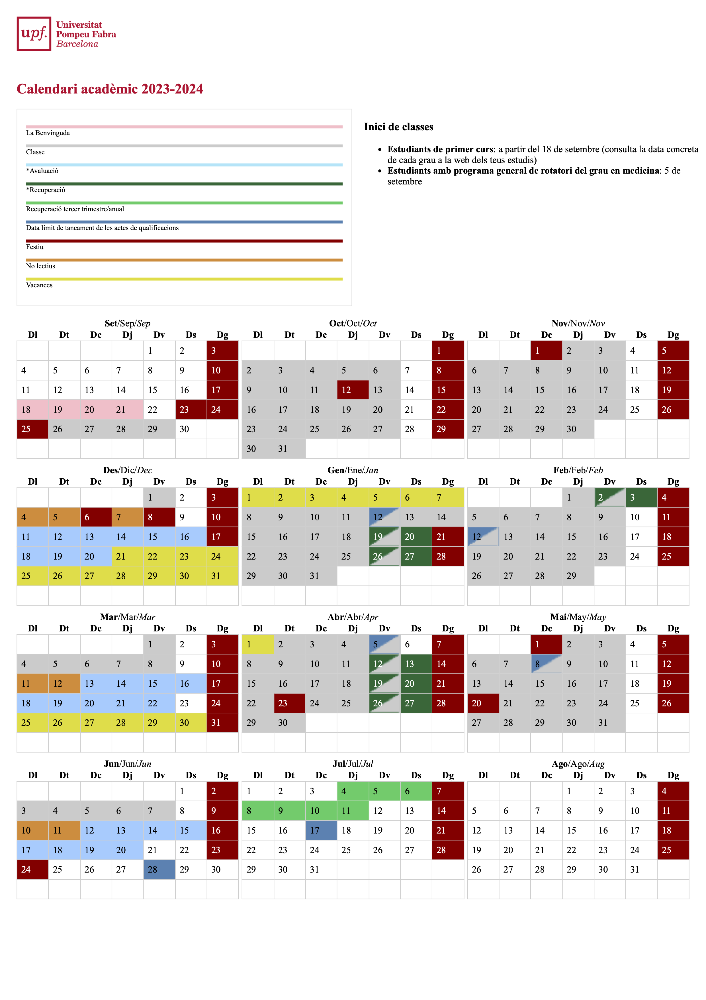
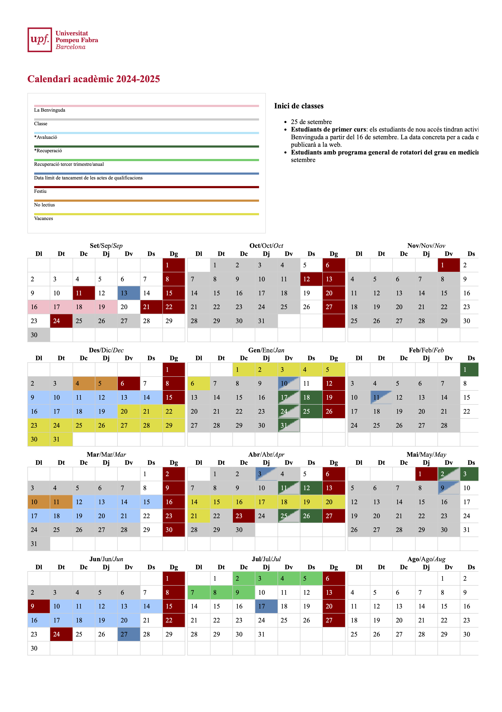

```{r setup, include=FALSE}
knitr::opts_chunk$set(echo = TRUE)
```

```{r, echo=FALSE, fig.align='center', out.width='40%'}
library(knitr)
```

## Introducció

Aquest informe presenta una anàlisi de conjunts de dades sobre el consum d'energia en dos campus de la Universitat Pompeu Fabra, concretament la Ciutadella del Poblenou. Els conjunts de dades compartits amb l'equip de recerca proporcionen el consum cada hora durant els anys naturals 2024 i una mesura refinada va proporcionar mesures cada 15 minuts.


```{r, echo=FALSE, message=FALSE}
    source("../about_the_data.R")
   
```

També utilitzem el calendari acadèmic de la UPF per als cursos 23-24 i 24-25 per obtenir l'etiqueta del dia com a festiu, vacances o no lectiu (a més si és dissabte o diumenge).

```{r, echo=FALSE, message=FALSE}
    source("../read_calendar.R")
```

Això indica que el 2024 va ser un any de traspàs i que les dades incloses 24 hores per dia. de la una del matí de l'1 de gener a la mitjanit del 31 de desembre de 2024 atès que el nombre de files correspon als 365 dies per 24 (i no hi ha correccions per canvi de horari d'hivern o estiu). El nombre de files dels fitxers per hora correspon als `r nrow(Calendari_UPF_2024)` dies per 24 hores: `r nrow(Calendari_UPF_2024)*24`. Els fitxers per quart de hora, per tant tenen quatra vegades mes, es a dir `r  format((24*4)*nrow(Calendari_UPF_2024), scientific = FALSE, big.mark = ",")` files.

El fitxer PDF del calendari 24-25 presenta dues anomalies en indicar dos dies d'un cap de setmana com a "classe":
```{r}
anomalies$la_data
```

Aquests dies seran considerats un dissabte i un diumenge.

``` {r, echo=FALSE, message=FALSE}
    source("../show_calendar_bar_plot.R")
```


Als conjunts de dades, verifiquem que no falten valors.

```{r, echo=FALSE, message=FALSE}
    source("../check-data.R")
```


Amb aquesta classificació del tipus de dia podem veure les dades de consum diari considerant la mitjana de cada dia de les dades per hora.

Pel campus de Ciutadella tenim el següent gràfic.

```{r, echo=FALSE, message=FALSE,out.width="100%"}
    source("../inspect-the-daily-data.R")
    source("../daily-ciudadella.R")
```

Pel campus de Poblenou tenim el següent gràfic.

```{r, echo=FALSE, message=FALSE,out.width="100%"}
    source("../daily-poble-nou.R")
```

Mostrant la distribució de la magnitud per tipus de dia s'observa que a Ciutadella, els dies que el calendari indica com altres, els d'avaluació, els de classe, la benvinguda i els no lectius tenen un consum alt. Mentre que els dissabtes, els diumenges, els festius i els dies designats com a vacançes tenen un consum baix. Hi ha alguns casos atípics en "altres dies", que analitzarem aviat, perquè, pel que fa a la trama anterior, semblen correspondre a quan el campus està tancat a l'agost. També hi ha uns quants dissabtes on el consum no és tan baix i hi ha alguns dies amrcats com vavacons que també apareixen una mica alts.

```{r, echo=FALSE, message=FALSE,out.width="100%"}
    source("../box-plot-ciudadella.R")
```

Abans de veure els valors atípics, fixem-nos en el tipus de distribució per dia al campus del Poblenou. Aquí es torna a observar que els dies d'”altres”, avaluació, de classe, la benvinguda, i els no lectius són de consum alt, mentre que dissabtes, diumenges, festius i vacances són de consum baix, però tenim més valors atípics.

```{r, echo=FALSE, message=FALSE,out.width="100%"}
    source("../box-plot-poble-nou.R")
```

Utilitzant el criteri de rang interquartílic (IQR interquartile range criterion) per identificar els valors  sospitósos o atípics. El criteri IQR significa que totes les observacions per sobre de
$q_{0.75}+1.5 (IQR)$
o per sota de
$q_{0.25}-1.5(IQR)$
(on
$q_{0.25}$
i
$q_{0.75}$
corresponen al primer i tercer quartil respectivament, i IQR és la diferència entre el tercer i el primer quartil) es consideren com a possibles valors atípics per R. En altres paraules, totes les observacions fora del següent interval es consideraran com a possibles valors atípics:
$$[ q_{0.25}-1.5(IQR), q_{0.75}+1.5 (IQR) ]$$
```{r, echo=FALSE, message=FALSE,out.width="100%"}
    source("../poblenou-classe-outliers.R")
```

Els valors atípics del campus Poblenou on el calendari indica que les classes són

```{r, echo=FALSE}
    paste(classe_poblenou_outliers$la_data,".")
```

Seria interessant investigar per què el 30 de setembre i el 4 de novembre tenen un consum tan baix registrat per a aquestes dues dates (ambdues dilluns), que el calendari indica com a dates de classe, i són d'alt consum per al campus de la Ciutadella.


Els valors atípics per a dissabtes, diumenges i festius al Poblenou tenen un consum molt inferior al d'un dia de classe normal (com veurem més endavant).

```{r, echo=FALSE, message=FALSE,out.width="100%"}
    source("../poblenou-saturday-outliers.R")
```

Els valors atípics per a les mesures de dissabte al campus Poblenou són
```{r, echo=FALSE}
    paste(saturday_poblenou_outliers$la_data,".")
```
Aquestes dates poden correspondre a esdeveniments com ara Jornades de Portes Obertes o ocasions similars. Necessitaríem més detalls de les activitats al campus. Tanmateix, es concentren als mesos de març, juny i desembre.

Els valors atípics per a les mesures de diumenge al campus Poblenou són
```{r, echo=FALSE}
    source("../poblenou-sunday-outliers.R")
    paste(sunday_poblenou_outliers$la_data,".")
```
Aquestes dates coincideixen amb el dissabte atípic, cosa que significa que hi va haver alguna cosa que va afectar aquests caps de setmana.

El valor atípic per a les mesures de fies festius al campus Poblenou es
```{r, echo=FALSE}
    source("../poblenou-festiu-outlier.R")
    paste(festiu_poblenou_outliers$la_data,".")
```
És a dir, la festa que celebra la Constitució té un consum baix però superior a els altres festius del 2024.

Passem als casos atípics del Campus de la Ciutadella.
Aquí, només apareixen els dissabtes o dies marcats com a altres.
Els valors atípics per a les mesures de dissabte al campus Ciutadella són
```{r, echo=FALSE}
    source("../ciutadella-saturday-outliers.R")
    paste(saturday_ciutadella_outliers$la_data,".")
```
Curiosament, aquests valors atípics per als dissabtes a Ciutadella són molt diferents dels del Poblenou. També tenim valors atípics perquè el valor és extremadament baix.
```{r, echo=FALSE}
    paste(saturday_ciutadella_lower_outliers$la_data,".")
```
Aquestes corresponen a dates d'agost quan el campus està tancat. En parlarem una mica més a mesura que analitzem els valors atípics per als dies indicats com a "altres" al calendari.
Al Campus de la Ciutadella, els valors atípics per als dies indicats com a "altres" són tots valors molt baixos, i tots corresponen a l'agost, probablement quan el campus està tancat.
```{r, echo=FALSE}
    source("../ciutadella-altres-outliers.R")
    paste(altres_ciutadella_lower_outliers$la_data,".")
```

## Classificació del consum energètic

A partir dels gràfics de les dates de l'any, sembla que hi ha clústers de consum, identificats pel tipus de dia. Els clústers són intervals de valors de consum al voltant de la seva mitjana representativa. Aplicarem un algoritme ràpid i comú per a això, concretament $k$-means.Aplicarem un algoritme ràpid i comú per a això, concretament k-means, primer tal com són i, en segon lloc, sense els valors atípics. Per estimar el nombre $k$ de clústers fem servir l'anàlisi de silueta. El coeficient de silueta és eficaç per als mètodes de clústering basats en la distància. Avalua la capacitat del model de clústering per aconseguir tant la **cohesió**  ($a(x_j) = \text{mean} \left\{ \| x_i - x_j \| : C_i = C_j \right\}$) com la **separació**  ($b(x_j) = \text{min}_{j\not=k}\text{mean}\left\{\|x_i-x_j\|: C_i = k\right\}$). El coeficient de silueta per a un punt $x_j$  de dades es defineix com: $$s(x_j) = \frac{b(x_j)-a(x_j)}{max\left\{b(x_j),a(x_j)\right\}}. $$ I per a l'agrupació global $C$, es pren el coeficient mitjà de la silueta sobre totes les observacions: $$S(C) = mean\left\{S(x_j), j=1,...,n\right\}.$$ El resultat oscil·la entre -1 i 1, i els coeficients de silueta més alts indiquen una millor qualitat d'agrupació. Per a cada $k$ de 2, 3, 4, 5, 6, 7, 8, 9 realitzem un gran nombre $N$ d'execucions independents de $k$-mitjanes (per aquestes dades, $N = 20$). Per a cada execució calculem el coeficient de silueta del resultat de l'agrupació.

### $k$-Means al Campus Poblenou

```{r, echo=FALSE}
library(cluster)
source("../k-means-clustering-poblenou.R")
```

En aquest cas, k=2 ens dóna un coeficient de silueta molt més gran (de mitjana) que valors més grans de $k$, per la qual cosa probablement triaríem això. En el següent gràfic, mostrem el valor representatiu mitjà del tipus de dia amb els clústers trobats. Els valors representatius del clúster són "o", mentre que el valor representatiu d'un tipus de dia és "x".

```{r, echo=FALSE}
library(cluster)
source("../match-clusters-poblenou.R")
```

Clarament, els dies etiquetats com a no lectiu, amb classe o avaluació corresponen a un clúster de somsum elevat, mentre que els festius, dissabtes i diumenges corresponen a l'altre clúster de consum baix. Els dies per a la benvinguda són d'alt consum però semblen ser significativament menors que les altres dates d'alt consum. Els dies indicats com a "altres" són inconsistents, potser a causa dels molts casos atípics quan el campus està tancat a l'agost. De la mateixa manera, hi ha dies de vacances que tenen un alt consum.

Repetim l'anàlisi, eliminant els valors atípics de cada tipus de dia.

```{r, echo=FALSE}
source ("../match-clusters-poblenou-no-outliers.R")
```

Això confirma el resultat anterior, els dissabtes, diumenges i festius són dies de baix consum. Les classes, els dies sense classes i els dies d'avaluació són d'alt consum. L'acollida té un consum alt però atípicament baix. Hi ha prou dies indicats com a "altres" quan el campus està tancat o de consum mitjà que aquests dies formen un grup inusual, de manera similar per als dies de vacances.

### $k$-Means al Campus Citadella

Ara apliquem les mitjanes $k$ als valors de consum d'energia del Campus Ciutadella.

```{r, echo=FALSE}
source("../k-means-clustering-ciutadella.R")
```

I emparellem els clústers

```{r, echo=FALSE}
source("../match-clusters-ciutadella.R")
```


Observem que els dos clústers també corresponen a un consum d'energia elevat (dies marcats com a lliçons, n-lliçons, "altres", avaluació i benvinguda). Després, un segon clúster de dies de consum molt baix: diumenges, dissabtes i festius. Els dies de vacances són inferiors als dies d'alt consum però superiors als dies de baix consum. No repetirem l'exercici sense valors atípics, ja que els valors atípics només es troben en els dies "altres", com a valors molt baixos i els dissabtes.

## Diferència estadísticament significativa

Tot i que els diagrames de caixa i l'anàlisi de clústers suggereixen que el consum d'energia és radicalment diferent els caps de setmana i festius que els dies amb activitats acadèmiques, realitzem algunes proves de significació estadística en els tipus de dia.

Realitzem una prova d'hipòtesi per veure si el tipus de dia representa una diferència estadísticament significativa en les mitjanes. Primer vam avaluar mitjançant la prova de Shapiro si les distribucions per tipus de dia són diferents de la normal. Malauradament, només els dies de benvinguda superen la prova, i només són 4.

```{r, echo=FALSE}
 source("../poblenou-pair-t-test.R")
```

Per tant, passem a una prova de Wilcoxon de dues mostres no aparellades.

## Per el campus Poblenou

```{r, echo=FALSE}
 source("../poblenou-wilcoxon-test.R")
```

Per al dia del tipus 'Avaluació', hem trobat una diferència significativa amb els següents tipus:

```{r, echo=FALSE}
wilcoxon_test_and_report(avaluacio_poblenou_df$la_magnitud_activa_entrante,classe_poblenou_df$la_magnitud_activa_entrante,"Avaluació","Classe")
wilcoxon_test_and_report(avaluacio_poblenou_df$la_magnitud_activa_entrante,altres_poblenou_df$la_magnitud_activa_entrante,"Avaluació","Altre")
wilcoxon_test_and_report(avaluacio_poblenou_df$la_magnitud_activa_entrante,saturday_poblenou_df$la_magnitud_activa_entrante,"Avaluació","Dissabte")
wilcoxon_test_and_report(avaluacio_poblenou_df$la_magnitud_activa_entrante,sunday_poblenou_df$la_magnitud_activa_entrante,"Avaluació","Diumenge")
wilcoxon_test_and_report(avaluacio_poblenou_df$la_magnitud_activa_entrante,festiu_poblenou_df$la_magnitud_activa_entrante,"Avaluació","Festiu")
wilcoxon_test_and_report(avaluacio_poblenou_df$la_magnitud_activa_entrante,benvinguda_poblenou_df$la_magnitud_activa_entrante,"Avaluació","La benvinguda")
wilcoxon_test_and_report(avaluacio_poblenou_df$la_magnitud_activa_entrante,no_lectiu_poblenou_df$la_magnitud_activa_entrante,"Avaluació","No lectiu")
wilcoxon_test_and_report(avaluacio_poblenou_df$la_magnitud_activa_entrante,vacances_poblenou_df$la_magnitud_activa_entrante,"Avaluació","Vacances")
```


Per al dia del tipus 'Classe', hem trobat una diferència significativa amb els següents tipus (sense incloure els que s'han trobat anteriorment):"

```{r, echo=FALSE}
wilcoxon_test_and_report(classe_poblenou_df$la_magnitud_activa_entrante,altres_poblenou_df$la_magnitud_activa_entrante,"Classe","Altre")
wilcoxon_test_and_report(classe_poblenou_df$la_magnitud_activa_entrante,saturday_poblenou_df$la_magnitud_activa_entrante,"Classe","Dissabte")
wilcoxon_test_and_report(classe_poblenou_df$la_magnitud_activa_entrante,sunday_poblenou_df$la_magnitud_activa_entrante,"Classe","Diumenge")
wilcoxon_test_and_report(classe_poblenou_df$la_magnitud_activa_entrante,festiu_poblenou_df$la_magnitud_activa_entrante,"Classe","Festiu")
wilcoxon_test_and_report(classe_poblenou_df$la_magnitud_activa_entrante,benvinguda_poblenou_df$la_magnitud_activa_entrante,"Classe","La benvinguda")
wilcoxon_test_and_report(classe_poblenou_df$la_magnitud_activa_entrante,no_lectiu_poblenou_df$la_magnitud_activa_entrante,"Classe","No lectiu")
wilcoxon_test_and_report(classe_poblenou_df$la_magnitud_activa_entrante,vacances_poblenou_df$la_magnitud_activa_entrante,"Classe","Vacances")
```


Per al dia del tipus 'Altre', hem trobat una diferència significativa amb els següents tipus (sense incloure els que s'han trobat anteriorment):"
```{r, echo=FALSE}
wilcoxon_test_and_report(altres_poblenou_df$la_magnitud_activa_entrante,saturday_poblenou_df$la_magnitud_activa_entrante,"Altre","Dissabte")
wilcoxon_test_and_report(altres_poblenou_df$la_magnitud_activa_entrante,sunday_poblenou_df$la_magnitud_activa_entrante,"Altre","Diumenge")
wilcoxon_test_and_report(altres_poblenou_df$la_magnitud_activa_entrante,festiu_poblenou_df$la_magnitud_activa_entrante,"Altre","Festiu")
wilcoxon_test_and_report(altres_poblenou_df$la_magnitud_activa_entrante,benvinguda_poblenou_df$la_magnitud_activa_entrante,"Altre","La benvinguda")
wilcoxon_test_and_report(altres_poblenou_df$la_magnitud_activa_entrante,no_lectiu_poblenou_df$la_magnitud_activa_entrante,"Altre","No lectiu")
wilcoxon_test_and_report(altres_poblenou_df$la_magnitud_activa_entrante,vacances_poblenou_df$la_magnitud_activa_entrante,"Altre","Vacances")
```

Per al dia del tipus 'Dissabte', hem trobat una diferència significativa amb els següents tipus (sense incloure els que s'han trobat anteriorment):"

```{r, echo=FALSE}
wilcoxon_test_and_report(saturday_poblenou_df$la_magnitud_activa_entrante,sunday_poblenou_df$la_magnitud_activa_entrante,"Dissabte","Diumenge")
wilcoxon_test_and_report(saturday_poblenou_df$la_magnitud_activa_entrante,festiu_poblenou_df$la_magnitud_activa_entrante,"Dissabte","Festiu")
wilcoxon_test_and_report(saturday_poblenou_df$la_magnitud_activa_entrante,benvinguda_poblenou_df$la_magnitud_activa_entrante,"Dissabte","La benvinguda")
wilcoxon_test_and_report(saturday_poblenou_df$la_magnitud_activa_entrante,no_lectiu_poblenou_df$la_magnitud_activa_entrante,"Dissabte","No lectiu")
wilcoxon_test_and_report(saturday_poblenou_df$la_magnitud_activa_entrante,vacances_poblenou_df$la_magnitud_activa_entrante,"Dissabte","Vacances")
```

Per al dia del tipus 'Diumenge', hem trobat una diferència significativa amb els següents tipus (sense incloure els que s'han trobat anteriorment):"

```{r, echo=FALSE}
wilcoxon_test_and_report(sunday_poblenou_df$la_magnitud_activa_entrante,festiu_poblenou_df$la_magnitud_activa_entrante,"Diumenge","Festiu")
wilcoxon_test_and_report(sunday_poblenou_df$la_magnitud_activa_entrante,benvinguda_poblenou_df$la_magnitud_activa_entrante,"Diumenge","La benvinguda")
wilcoxon_test_and_report(sunday_poblenou_df$la_magnitud_activa_entrante,no_lectiu_poblenou_df$la_magnitud_activa_entrante,"Diumenge","No lectiu")
wilcoxon_test_and_report(sunday_poblenou_df$la_magnitud_activa_entrante,vacances_poblenou_df$la_magnitud_activa_entrante,"Diumenge","Vacances")
```

Per al dia del tipus 'Festiu', hem trobat una diferència significativa amb els següents tipus (sense incloure els que s'han trobat anteriorment):"

```{r, echo=FALSE}
wilcoxon_test_and_report(festiu_poblenou_df$la_magnitud_activa_entrante,benvinguda_poblenou_df$la_magnitud_activa_entrante,"Festiu","La benvinguda")
wilcoxon_test_and_report(festiu_poblenou_df$la_magnitud_activa_entrante,no_lectiu_poblenou_df$la_magnitud_activa_entrante,"Festiu","No lectiu")
wilcoxon_test_and_report(festiu_poblenou_df$la_magnitud_activa_entrante,vacances_poblenou_df$la_magnitud_activa_entrante,"Festiu","Vacances")
```

Per al dia del tipus 'La benvinguda', hem trobat una diferència significativa amb els següents tipus (sense incloure els que s'han trobat anteriorment):"


```{r, echo=FALSE}
wilcoxon_test_and_report(benvinguda_poblenou_df$la_magnitud_activa_entrante,no_lectiu_poblenou_df$la_magnitud_activa_entrante,"La benvinguda","No lectiu")
wilcoxon_test_and_report(benvinguda_poblenou_df$la_magnitud_activa_entrante,vacances_poblenou_df$la_magnitud_activa_entrante,"La benvinguda","Vacances")
```

Per al dia del tipus 'No lectiu', hem trobat una diferència significativa amb els següents tipus (sense incloure els que s'han trobat anteriorment):"

```{r, echo=FALSE}
wilcoxon_test_and_report(no_lectiu_poblenou_df$la_magnitud_activa_entrante,vacances_poblenou_df$la_magnitud_activa_entrante,"No lectiu","Vacances")
```

Per tant, es confirma que, al campus de Poblenou, amb una significació estadística del 95%, els dissabtes, diumenges i festius són un altre grup de dies per a classes, no lectius i dias amb avaluació. Els dies de vacances i els "altres" són diferents de tots, com ho es "la benvinguda".

## Per el campus Ciudadella

El campus de la Ciutadella ofereix algunes variacions menors respecte al Campus Poblenou, amb alguns aspectes en comú. Els dissabtes, diumenges i festius no tenen cap diferència significativa entre ells i representen un consum baix. A més, els dies de vacances són diferents de qualsevol altre tipus de dia. Tanmateix, una diferència amb el Poblenou és que entre els tipus de dia de consum elevat, els no lectius i els avaluacions es troben lleugerament per sota dels dies de benvinguda, els dies amb classe i els altres.

Els resultats parell per parell es mostren a continuació.

```{r, echo=FALSE}
source("../ciutadella-wilcoxon-test.R")
```

## Gràfics de límit amb els dos clústers

Ara que tenim prou evidència que indica dos tipus de consum —consum alt i consum baix— podem traçar el límit entre els clústers. A més, podem observar que hi ha dies que també són atípics en aquesta classificació. És a dir, hi ha dies de vacances d'alt consum o un parell de dissabtes amb alt consum. Ara podem investigar aquests valors que es troben a l'altre costat del límit.

Per el campus Poblenou, es clar la distinció entre dies amb ús elevat i  i dies amb poc ús.

```{r, echo=FALSE}
source("../global-outliers-poblenou.R")
```

I per el campus Ciutadella, els gràfic es molt similar.

```{r, echo=FALSE}
source("../global-outliers-ciutadella.R")
```

Aquesta frontera entre dies amb alt consum i dies amb baix consum ens convida a enumerar els dies que estan etiquetats com a vacances o dissabte al calendari del campus Ciutadella, però el consum és alt.

```{r, echo=FALSE}
source("../list-global-outliers-ciutadella.R")
```

Per al campus del Poblenou, també hi ha dies de vacances amb un consum elevat

```{r, echo=FALSE}
source("../list-global-outliers-poblenou.R")
```


## Model de regressió multilineal per predir el consum en funció del tipus de dia

Ara podem aplicar la regressió logística per predir si un dia és d'alt o de baix consum.

For the Poblenou campus we obtain the dollowing model.

```{r, echo=FALSE}
source("../enconding-logistic-regression-high-vs-low-consumption-poblenou.R")
```

```{r}
summary(model)
```

Observem que un dia té una probabilitat del 61% de ser un dia d'alt consum. Tanmateix, si és un dia amb classes, tenim un 37% addicional, cosa que fa que tingui més d'un 98% de probabilitats que sigui un dia d'alt consum. Anàlogament, si no és lectiu (o d'avaluació, o de benvinguda), s'afegeix un 38% i tenim un 99% de que el  dia sigui d'alt consum.

Tant si és dissabte, diumenge o un festiu, cadascun elimina un 61% de probabilitat, cosa que fa que sigui gairebé un 0% de probabilitat un dia d'alt consum (per tant, gairebé amb tota seguretat un dia de baix consum), i els dies de vacances també són probables que siguin un dia de baix consum però amb una mica menys de força.

Totes aquestes variables són predictors altament significatius, excepte si és un dia de benvinguda, però això probablement es deu al fet que només hi ha quatre dies a l'any d'aquest tipus.


Per al campus de la Ciutadella, el model de regressió logística és el següent:

```{r, echo=FALSE}
source("../enconding-logistic-regression-high-vs-low-consumption-ciutadella.R")
```

```{r}
summary(model)
```

En el  campus Ciutadella, un dia té un 81% de probabilitat de ser d'alt consum. S'afegeix un 18% addicional si és el dia de benvinguda, el dia es no-lectiu o és un dia d'avaluació, cosa que fa que sigui un 99% (essencialment segur) que sigui d'alt consum. També és d'alt consum si hi ha classes. Això afegeix un 17% per fer que sigui del 98% probable que sigui així.

Si és diumenge o festiu, és un 0% d'alt consum (o un 100% de baix consum). Dissabte amb un 97% de baix consum i vacances amb un 53% de baix consum.

En el model de regressió logística per a Ciutadella tots els factors són significatius, amb una mica menys per als dies no-lectius o els dies de benvinguda (però els dies de benvinguda són molt pocs, la qual cosa explica això).

Per predir millor el consum, caldrien més factors que hi contribueixen. Un d'aquests possibles factors és si (temperatura, pluja, hores de sol)

## (PER FER) Anàlisi de la temperatura durant les hores del dia


## Recomanacions


- Que els estudiants vinguin al campus o no té menys importància a si el personal hi vindrà o no. És a dir, els "festius", dissabtes i diumenges, i els dies d'agost quan el campus està tancat (o Pasqua i Nadal), tenen un consum extremadament baix i formen un clúster clar. Tanmateix, els dies "sense classes" o els dies d'avaluació tenen un consum elevat. Un altre tipus, "l'acollida", també té un consum elevat, tot i que una mica menys al Campus del Poblenou, però es podria considerar "l'acollida" ja que només els màsters, els programes de doctorat i els estudiants de primer any són la població estudiantil (no de segon any i posteriors). Per tant, seria interessant investigar l'ús de les sales segons la data. Això seria útil per entendre la variància en dies com "sense classe" o per què alguns dies de vacances són tan alts.


## Apèndix

Els calendaris acadèmics publicats per la UPF al web.

```{r, echo=FALSE, fig.align='center', out.width='40%'}

```

```{r, echo=FALSE, fig.align='center', out.width='40%'}

```
